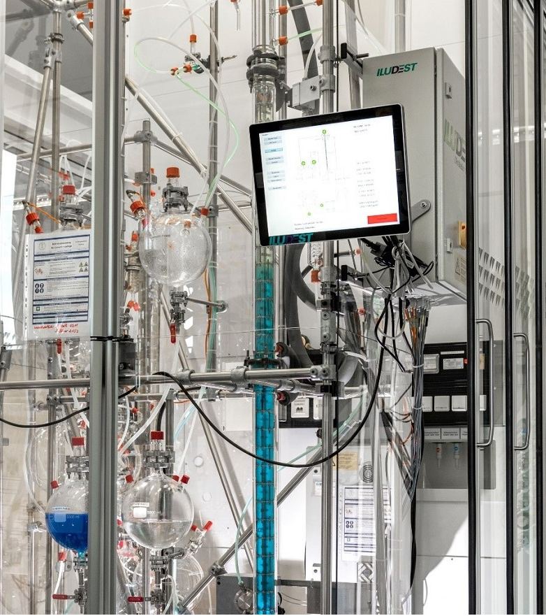
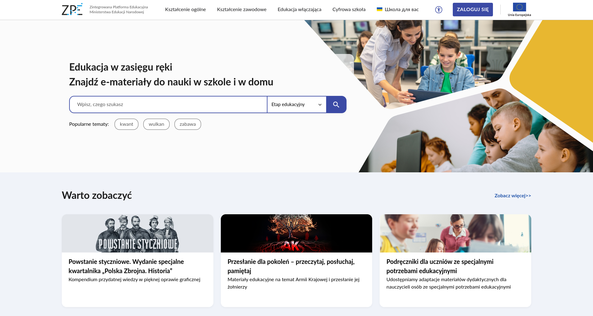
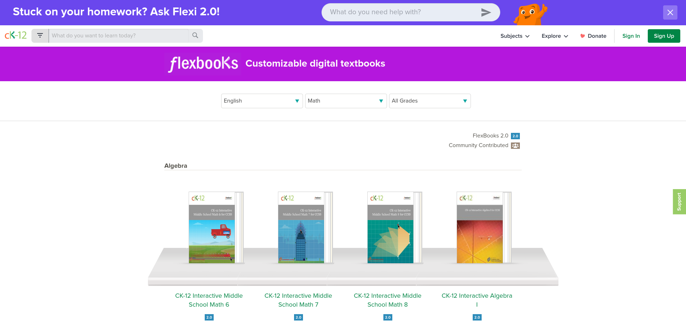
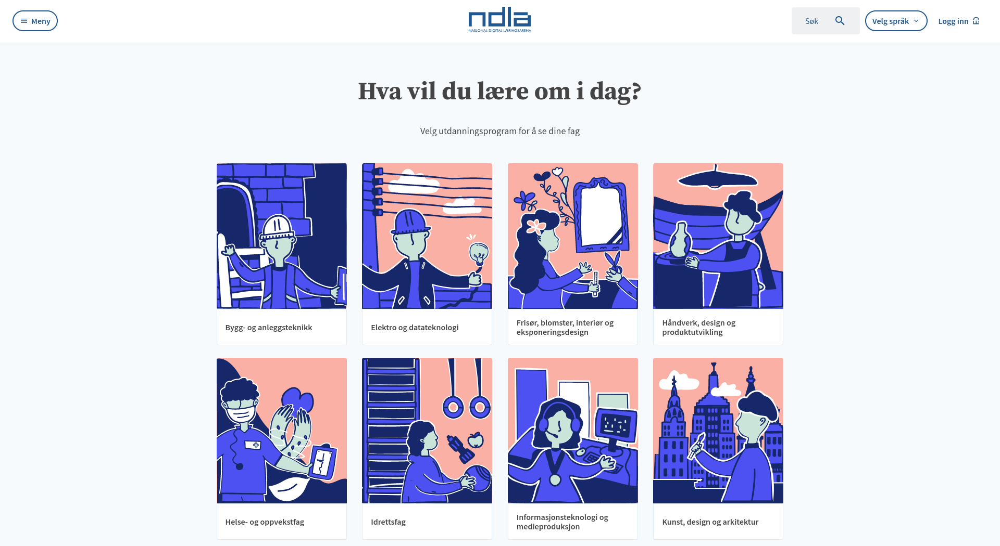

<!--
author:   Andre Dietrich; Sebastian Zug

email:    LiaScript@web.de

version:  0.0.1

language: en

narrator: US English Female

link:     style.css

comment:  Try to write a short comment about
          your course, multiline is also okay.

-->

[](https://liascript.github.io/course/?https://raw.githubusercontent.com/LiaPlayground/University-Future-Festival-2024/main/README.md)


# RemoteLabs as OER

<div class="left">

## The next evolutionary step


---

André Dietrich, Sebastian Zug

TU Bergakademie Freiberg

---

### University:Future Festival 2024

### 5. Juni 2024

---

</div>

<div class="right">



</div>


## Motivation

                    {{0-1}}
**************************************************

`````````````````````````````````````````````````````

    "$\textbf{Out Starting Point}$"                        "$\textbf{Our Vision}$"


             Remote
           Laboratory                                         Digital
                                                             Laboratory
                                                              as OER
      ----------*-----                                       ----*----->
 Traditional                                                        
 Laboratory                                                          
 Concepts


 2014       2017               2020     2021                   2024 ...


`````````````````````````````````````````````````````
<!-- class="highlight" -->
> __Project:__ [Industrial eLab Projekt - Industrial eLab](https://www.wihoforschung.de/wihoforschung/de/bmbf-projektfoerderung/foerderlinien/forschung-zur-digitalen-hochschulbildung/erste-foerderlinie-zur-digitalen-hochschulbildung/industrial-elab/industrial-elab_node.html), BMBF (2017-2020), TU Freiberg, Otto-von-Guericke Universität Magdeburg - [Industrial eLab Magdeburg](https://www.youtube.com/watch?v=bICfKRyKTwE)

**************************************************


                     {{1-2}}
**************************************************

`````````````````````````````````````````````````````
                                      text based
                                   .------>
                            OER   /   meta data
             Remote       .------+-------->
           Laboratory    /        \   obstacles               Digital
                        /          .------>                  Laboratory
                       /                                       as OER
      ----------*-----+                                      ----*----->
 Traditional                                                   
 Laboratory                                                    
 Concepts                            
                         
                            
                            


`````````````````````````````````````````````````````

<!-- class="highlight" -->
> __Project:__
> [MOER Projekt - Multi-Autoren-Tool für OER-Inhalte](https://www.wihoforschung.de/wihoforschung/de/bmbf-projektfoerderung/foerderlinien/forschung-zur-digitalen-hochschulbildung/querschnittsprojekte/moer/moer_node.html), BMBF (2020) - TU Bergakademie Freiberg

<!-- class="highlight" -->
> __Project:__ 
> [Programmieren im Team - DiP-iT](https://www.wihoforschung.de/wihoforschung/de/bmbf-projektfoerderung/foerderlinien/forschung-zur-digitalen-hochschulbildung/dritte-foerderlinie-zur-digitalen-hochschulbildung/dip-it/dip-it_node), BMBF, (2020-2023) - TU Bergakademie Freiberg, Otto-von-Guericke Universität Magdeburg, Humboldt Universität zu Berlin


**************************************************


                     {{2-4}}
**************************************************

`````````````````````````````````````````````````````
                                      text based
                                   .------>-----------.
                            OER   /   meta data        \
             Remote       .------+-------->             \
           Laboratory    /        \   obstacles          \    Digital
                        /          .------>               \  Laboratory
                       /                                   \  as OER
      --------O-*---O-+                                     +----*----->
 Traditional           \                     multi-typed   /        
 Laboratory             \                 .--->-----------+          
 Concepts                \               /               /
                          .----------O--+               /
                            Digital      \  composable /
                            Laboratories  .-----o->---'

`````````````````````````````````````````````````````

<!-- class="highlight" -->
> __Project:__
> [Crosslab](https://cross-lab.org/) - Flexibel kombinierbare Cross-Reality Labore in der Hochschullehre: zukunftsfähige Kompetenzentwicklung für ein Lernen und Arbeiten 4.0, Stiftung Innovation in der Hochschullehre (2021 - 2025) - TU Bergakademie Freiberg, TU Illmenau, TU Dortmund, Nordakademie

**************************************************


## Edrys

> Edrys is an open and modular remote teaching platform (and the first live LMS)
>
> Source: https://github.com/edrys-org

    {{1}}


### Concepts

    {{0-1}}


     {{1}}


## Edrys-Lite

{{1}} WebSite: https://edrys-labs.github.io


### Technologies

Peer-To-Peer in da Browser

    {{1-2}}
``` ascii    __Fig:__ Classic Client & Server Applications
    👨🏾‍💻 --.     .-- 👩‍💻
          \   /

👩‍💻 ------  🖥️  ------ 👨🏾‍💻

          /   \
    👨🏾‍💻 --'     '-- 👩‍💻
```

    {{2}}
``` ascii    __Fig:__ Peer^2^Peer- or Mesh-Networks
- - - --👨🏾‍💻-----👩‍💻
              /  \
             /    \
    👩‍💻------+-----👨🏾‍💻- - -
      \    /      /
       \  /      /
        👨🏾‍💻     👩‍💻- - - -
```

#### 1. WebRTC

> The __Web Real-Time Communication__ is a free and open-source project providing web browsers and mobile applications with real-time communication (RTC) via application programming interfaces (APIs).
> It allows audio and video communication to work inside web pages by allowing direct peer-to-peer communication, eliminating the need to install plugins or download native apps...
>
> _Source: [Wikpedia](https://en.wikipedia.org/wiki/WebRTC)_

    {{0-1}}
``` ascii
                     (WebRTC)
Alice 👩‍💻 <------------------------------> 👨🏾‍💻 Bob
```

    {{1}}
``` ascii
               (Signaling Server)

       .-------------> 🖥️ --------------.
       |    "{1}{}"   /  A      "{2}{}" |
       |             /    \             |
       |            /      \            V
                   /        \
Alice 👩‍💻 <--------'          '--------- 👨🏾‍💻 Bob
            "{4}{}"             "{3}{}"
      A                                  A
      |                                  |
      '----------------------------------'
      A    "{5}{Direct Communication}"   A
      |                                  |
      '-- - - - - - - - - - - - - - - - -'
             "{6}{InDirect via TURN}"
```

    {{7}}
> More confusing information on WebRTC:
>
> !?[WebRTC](https://www.youtube.com/watch?v=7cbD-hFkzY0&autoplay=1&start=412)


#### 2. CRDTs

> A _**C**onflict-free **R**eplicated **D**ata **T**ype_ (CRDT) is a new type of data structure[^1] that can be replicated across multiple instances in a network with the following guarantees:

    {{1}}
1. A replica can be updated independently, concurrently and without coordinating with other replicas.
2. Inconsistencies can be resolved automatically.
3. Although replicas may have different state, they are guaranteed to eventually converge.

    {{2}}
__Task:__ Implement an distributed counter

    {{3}}
``` ascii
Alice 👩‍💻

[0]---------*-->[5]--[+1 = 6]--------*-->[8]-- - - - - - - - - - - - 
           /            \           /          \
          A              V         A            \
         /                        /              \
[0]---[+5 = 5]-----------------[+2 = 7]-- - - - --*- - - - - - - - - -

Bob 👨🏾‍💻
```

    {{4}}
__Solution:__ Use Sets and Unions instead... 

    {{5}}
``` ascii
Alice 👩‍💻

{(a,0)}----------*-->{(a,0),(b,5)}->{(a,1),(b,5)}---*-->{(a,1),(b,7)}
                /                         \        /   
               A                           V      A   
              /                                  /
{(b,0)}---{(b,5)}----------------------------{(b,7)}-----------------

Bob 👨🏾‍💻
```

    {{6}}
<section>

__ Implementations__

- [Automerge](https://automerge.org)
- [__Yjs__](https://docs.yjs.dev)

</section>


[^1]: The CRDT concept was defined in 2011 by Marc Shapiro, Nuno Preguiça, Carlos Baquero and Marek Zawirski.

      See also: https://en.wikipedia.org/wiki/Conflict-free_replicated_data_type

### Demo

- __WebSite:__ https://edrys-labs.github.io

- __Modules:__ https://github.com/topics/edrys-module?q=edrys-lite

- __Labs:__ https://github.com/topics/edrys-lab


## What have Poland and Arnold Schwarzenegger in common?

                {{1}}
<!-- style="border: 1px solid black" -->
> # Poland Is Pioneering the World’s First National Open Textbook Program
>
> Access to educational materials varies considerably across the world. Many in low- and middle-income countries do not have textbooks, and the ones that exist are often out of date. Two recent initiatives in Poland, however, are getting free, open textbooks into classrooms—textbooks that are available online and can be easily adapted, translated, and improved upon by teachers and students...
>
> _ Source: https://www.opensocietyfoundations.org/voices/poland-pioneering-worlds-first-national-open-textbook-program _
>
> {{2}} 
>
> The literature can be found here: https://zpe.gov.pl

                {{3}}
<!-- style="border: 1px solid black" -->
> # Arnold Schwarzenegger’s Flexbook Initiative
>
> These flexbooks are open textbooks that are shared under the Creative-Commons license CC-BY-NC-SA (Attribution-NonCommercial-ShareAlike).
>
> {{4}} 
>
> _ Source: https://www.ck12.org/fbbrowse/ _


                {{5}}
<!-- style="border: 1px solid black" -->
> # Norwegian Digital Learning Arena
>
> ... a joint county enterprise offering open digital learning assets for upper secondary education. In addition to being a compilation of open educational resources (OER), NDLA provides a range of other online tools for sharing and cooperation...
>
> {{6}} 
>
> _ Source: http://ndla.no/ _

                {{7}}
